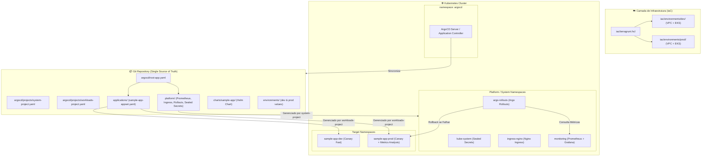

# 🚀 Repositório Monorepo GitOps & Infraestrutura Enterprise

<p align="center">
  <b>Português</b> | <a href="README.en.md">English</a>
</p>

***

[](https://github.com/HeloisaPeGarcia/argo-cd/actions/workflows/gitops-ci.yml)


Este repositório estabelece um **padrão de arquitetura de referência Enterprise Monorepo** para provisionamento de infraestrutura em nuvem (**Terragrunt / Terraform**) e implantação declarativa de aplicações (**Argo CD GitOps**).

A solução foi desenhada com foco em **desacoplamento em camadas**, **menor privilégio (RBAC)**, **resiliência de workloads** e **DevSecOps**.

---

## 📐 Arquitetura do Monorepo



---

## 📂 Estrutura de Pastas Reorganizada

```
.
├── .github/
│   └── workflows/
│       └── gitops-ci.yml               # CI/CD: Linting, Kubeconform (Strict), Trivy e Gitleaks
├── iac/                                # Infraestrutura como Código (Terragrunt + Terraform)
│   ├── terragrunt.hcl                  # Estado remoto global (S3 + DynamoDB) e providers AWS
│   ├── _envcommon/                     # Configurações reutilizáveis (DRY) de VPC e EKS
│   └── environments/
│       ├── dev/ (env.hcl, vpc, eks)    # Infraestrutura do ambiente Dev (Capacity: SPOT)
│       └── prod/ (env.hcl, vpc, eks)   # Infraestrutura do ambiente Prod (Capacity: ON_DEMAND)
├── platform/                           # Add-ons de Plataforma e Serviços do Cluster
│   ├── argo-rollouts.yaml
│   ├── nginx-ingress.yaml
│   ├── prometheus.yaml
│   ├── sealed-secrets.yaml
│   └── notifications-config.yaml
├── applications/                       # Manifestos e ApplicationSets das aplicações
│   └── sample-app-appset.yaml
├── argocd/                             # Bootstrap do ArgoCD e Governança RBAC
│   ├── root-app.yaml                   # Ponto de entrada (App-of-Apps)
│   └── projects/
│       ├── system-project.yaml         # AppProject com privilégios de plataforma
│       └── workloads-project.yaml      # AppProject restrito para times de desenvolvimento
├── charts/                             # Charts Helm Reutilizáveis
│   └── sample-app/                     # Chart com PDB, Non-root securityContext e TopologySpread
│       ├── Chart.yaml
│       ├── values.yaml
│       └── templates/ (rollout, pdb, ingress, service, sealed-secret, hpa, analysis)
├── environments/                       # Overrides de variáveis por ambiente
│   ├── dev/values.yaml
│   └── prod/values.yaml
├── scripts/
│   ├── bootstrap.bat                   # Script de automação Windows
│   └── bootstrap.sh                    # Script de automação Linux/macOS/WSL
├── Taskfile.yml                        # Task runner cross-platform (Alternative a Makefile)
└── README.md
```

---

## 🌟 Principais Decisões Arquiteturais & Melhorias

### 1. Camada de IaC Declarativa (Terragrunt)
- **Zero Duplicação:** Módulos de infraestrutura isolados em `iac/_envcommon/` e chamados via include pelos ambientes `dev` e `prod`.
- **Estado Seguro:** Backend remoto dinâmico S3 com criptografia ativa e locking via DynamoDB para prevenir conflitos de estado simultâneos.

### 2. Isolação de Governança (`AppProjects`)
- **`system-project`**: Permite gerenciar recursos globais (`Namespace`, `ClusterRole`, `CustomResourceDefinition`) apenas para componentes da plataforma.
- **`workloads-project`**: Impede que aplicações de negócio modifiquem permissões de cluster, restringindo o escopo estritamente aos seus namespaces (`sample-app-dev` e `sample-app-prod`).

### 3. Resiliência de Workloads no Kubernetes
- **PodDisruptionBudget (PDB):** Garante disponibilidade de réplicas ativas durante drenagens de nós ou manutenção de cluster.
- **TopologySpreadConstraints:** Distribui as réplicas dos Pods entre Zonas de Disponibilidade (AZs) para tolerância a falhas de infraestrutura.
- **Pod & SecurityContext Hardening:** Desativa escalada de privilégios (`allowPrivilegeEscalation: false`) e impõe execução como usuário não-root.

### 4. DevSecOps no Pipeline CI/CD
- **Validação Estrita:** Kubeconform executado sem tolerância a falhas (`-strict`), garantindo que apenas manifestos conformes com a especificação da API do Kubernetes sejam aceitos.
- **Scanners Automáticos:** Integração do **Trivy** (varredura de más configurações de segurança em Helm/K8s) e **Gitleaks** (detecção preventiva de vazamento de segredos).

---

## ⚡ Como Executar Localmente

### Opção A: Usando Taskfile (Recomendado)

```bash
# Inicializar o cluster local e o ArgoCD
task dev:up

# Executar linters no Helm Chart
task lint

# Executar plan do Terragrunt para o ambiente DEV
task iac:plan

# Destruir o cluster local
task dev:down
```

### Opção B: Usando Scripts Automatizados

- **Windows:**
  ```cmd
  scripts\bootstrap.bat
  ```

- **Linux / macOS / WSL:**
  ```bash
  chmod +x scripts/bootstrap.sh
  ./scripts/bootstrap.sh
  ```
